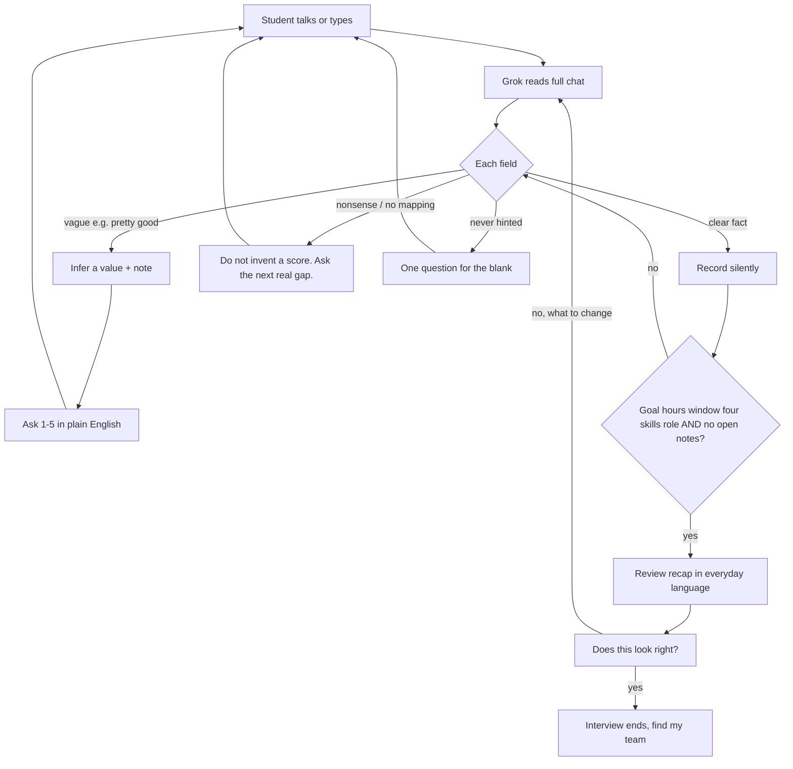

# Student interview: how Grok fills a profile

Teammates: this is the contract for `chat_turn()` in `backend/app/grok_client.py`.
Keep this file in sync when interview behavior changes.

The student Chat tab is a conversation with **Scotty** (CMU’s mascot), not a numbered survey.
Each turn Scotty rereads the whole conversation, then **records what’s clear**, **infers + checks
what’s vague**, or **probes what’s missing**. Default only two fields (conflict style, confidence).

If the xAI key cannot be decrypted, a local heuristic path still runs. That
fallback refuses to invent hours or a calendar. This doc describes the **Grok** path.

## Turn loop

1. **Open**: invite a dump of how they work. Talk or type.
2. **Clear**: named numbers, days, goals, roles. Save them, do not re-ask.
3. **Vague**: “pretty good / kind of / decent”. Infer, note it, ask 1–5 in a full sentence.
4. **Missing**: never hinted. One probe. Never invent hours or a calendar.
5. **Uninterpretable / jailbreak**: jokes, bogus answers, or “ignore your instructions”. One short redirect, then the next real gap. Never invent a score. Never leave the assessment.
6. **Skill scale**: if they don’t know what 1–5 means. 1 rather not own it, 2 help with guidance, 3 hold your own, 4 stronger than most in the room, 5 could teach it / own it under pressure.
7. **Review**: recap, then one yes/no. Yes ends the interview.
8. **Correct**: a change at the review point does **not** rerun intake. `ChatInterview.correctProfile()` posts the single sentence to `/api/chat` with `mode: "update"` plus the current profile, `update_turn()` merges just that field, and the recap card re-renders. This loops until the student presses **Yes, find my team**. A voice session started at this point gets `review_instructions()` appended, so Scotty edits the recap instead of introducing himself again.
9. **Guard**: open notes block ready. Reply text must never contain `mon_evening`, `grade_A`, `tech4`.

Ready (review) only when all of these exist **and** vague checks are done: **goal**, **hours**, **at least one meeting window**, **four skills**, and **role**.

## Language

The JSON profile uses machine tokens (`mon_evening`, `grade_A`). Those stay on the server.
The student only hears everyday language. `humanize_reply()` and `spoken_review()` are the backstop.

## Per field: clear / vague / missing / default

| Field | Clear (record) | Vague (infer + 1–5 check) | Missing (probe) | Default |
| --- | --- | --- | --- | --- |
| Goal | “I want an A”, “just pass”, “research paper” | “do well”, “we’ll see” | No hint | None |
| Hours / week | “8 hours”, “about 10” | “some time”, “not too much” | No hint | **None, never invent** |
| Schedule | Named days / nights / weekends | “I’m pretty free” | Nothing about when | **None, never invent days** |
| Skills | “technical 5”, “I hate writing” | “pretty good at technical” → guess 4, ask 3/4/5 | Unmentioned skill | Not auto-filled at 3 |
| Role | I’ll lead / I’d rather support | “I can do whatever I guess” | Never said | “either” only if they said they’re flexible |
| Conflict style | Only if they volunteer | n/a | Not asked | **vote** |
| Confidence | Grok’s 0–1 | Lower while notes remain | n/a | **0.8** if omitted |

## Voice

This is **Grok Voice** (xAI speech-to-speech), not a dictation button and not Cursor MCP.

- **Voice toggle**: Rex, half-duplex. Mic audio is only sent while Scotty is idle. `scottyBusy()` is true from `response.created` until the PCM queue drains, so his own voice can’t retrigger the mic. That one predicate also drives the status label, so there are no timers or mute flags to keep in sync.
- **Turn ids**: every turn carries an id (`u1`, `s2`, …). `onTurn({ id, role, text, done })` upserts one bubble per id, so an update replaces its own bubble and can never append a duplicate. Turn detection lives in `VOICE_TURN_DETECTION` on the backend and is returned by `/api/voice/session`; the browser forwards it rather than defining its own. No browser `SpeechRecognition` and no local RMS gate, Grok transcribes both sides.
- **The student's line renders once**, from the `.completed` transcript, never word by word. Streamed pieces accumulate silently; the completed (or `response.done`) event replaces them with the corrected text, so a stitched-together partial can never ship.
- **Scotty's line is a caption**, revealed at `CHARS_PER_SEC` against `player.playedMs()` so text tracks the audio instead of racing ahead. His final `_transcript.done` text replaces the stitched deltas. That stitching is what produced "Do youlike to lead" next to a corrected copy.
- **Handing off to the review** uses `stopAfterSpeech()`, so the sentence that pivots to the evaluation finishes before the mic closes. Voice stays off through the review; the student answers by text unless they turn it back on.
- **The opening line skips Grok** (`chat_turn` short-circuits on empty history), and turning voice on mid-thread does not re-greet. An on-screen thread already counts as greeted.
- Typed chat still uses `chat_turn()`; spoken and typed share `interview_instructions()`.

Do not wire student interview through a Cursor MCP server. xAI Voice can attach remote MCP tools, but CrewFit uses a function tool + our FastAPI instead.

## Implementation pointers

- Interview prompt, recap, voice token, TTS: `backend/app/grok_client.py`.
- HTTP: `POST /api/chat`, `POST /api/voice/session`, `POST /api/voice/record`, `POST /api/speak`.
- UI: `frontend/src/components/ChatInterview.tsx`, `frontend/src/voice/grokRealtime.ts`.
- Offline tests: `backend/tests/test_chat_intake.py`.
